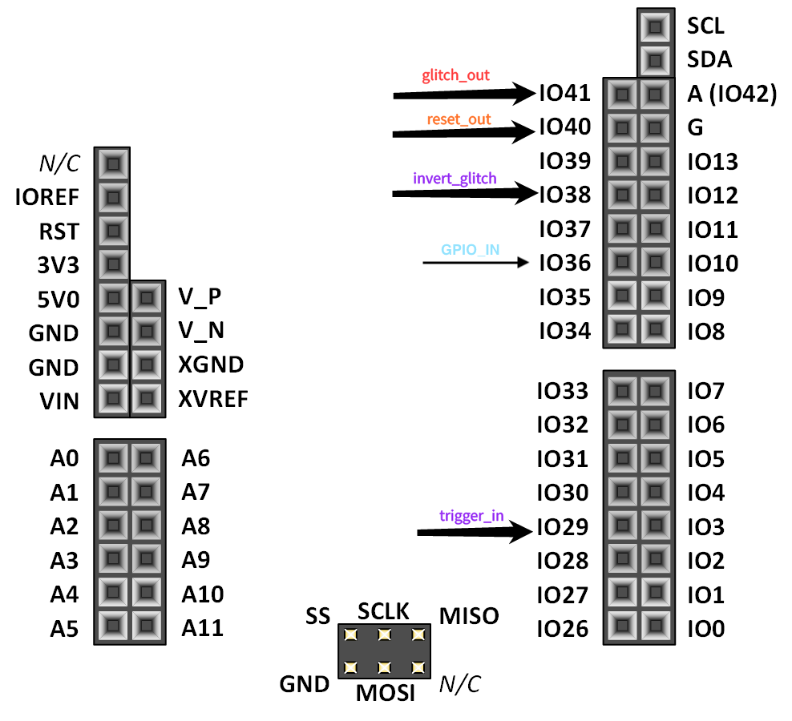
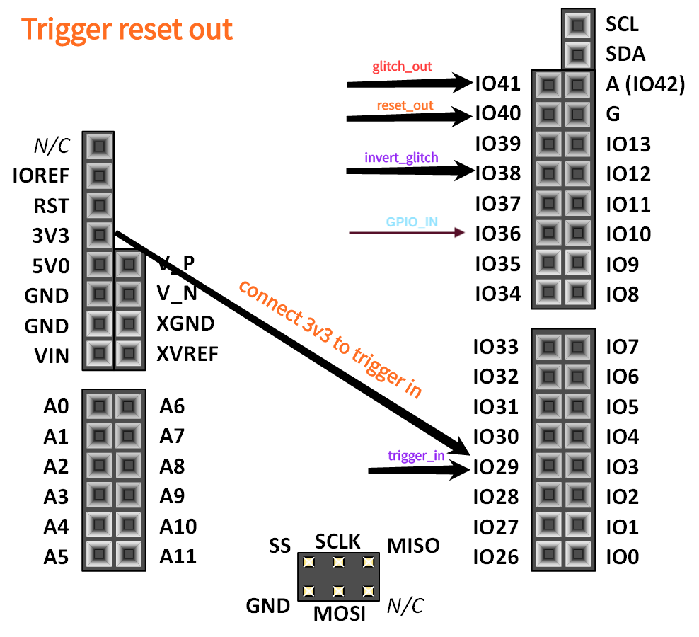
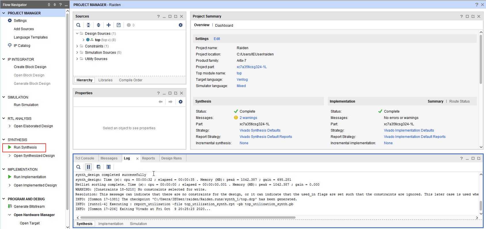
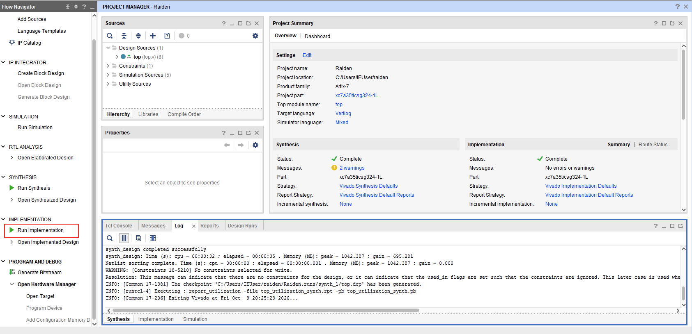
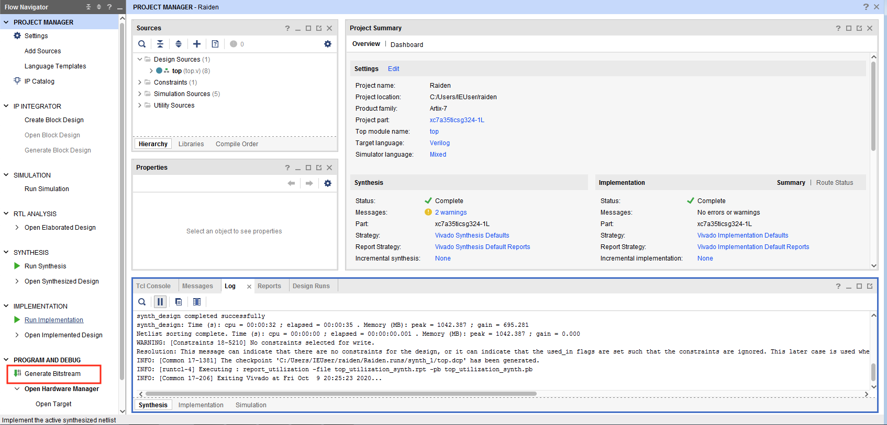

# Raiden project

### Raiden is open source pulse generator project based on Xilinx Arty-7 AT-35 FPGA board. It supports any voltage glitching frontend like MAX4619CPE+ and works with any EMFI (Electromagnetic field Probe solution). Current version was tested with NewAE ChipShouter EMFI device and works as expected. It was created as part fo the research project to fill gap between flexible solution and costs by h0rac (Grzegorz Wypych) and @Major Malfunction (Adam Laurie) and released during Black Hat Asia 2020 as open source project.

 #### 1) Docs folder includes application schematic and connection diagram to Raiden based FPGA, power supplies and target board

#### 2) Builds folder includes current release version binary files. "top.bin" file could be loaded to permanent flash storage like SPI Flash and "top.bit" can be used as bitstream file for FPGA

#### 3)  Wiki includes sources build setup for Xilinx FPGA for anyone interested how to build own .bin and .bit files.

### 4) Raiden port connections

#### 4.1) Standard port pinout

#### 4.2) Trigger out port pinout

### 5) Raiden LEDs
##### 5.1) LD0
###### -BLUE - armed
###### -GREEN - glitch started 
###### -RED - glitch finished
##### 5.2) LD7
###### -Blinking green - heartbit
##### 5.3) LD2
###### -GREEN - triggered

### 6) Building process and deploy

##### 6.1 Prerequisites 
* Vivado Studio
* Xilinx Arty-7 AT-35 FPGA devboard or AT-100
* **Please note that verilog should work on different FPGAs also but Constraints file could be different**

##### 6.2 Build process

###### 6.2.1 After you clone repository, run Vivado Studio and open **Raiden.xpr** file

###### 6.2.2 After project is loaded start with synthesis process by clicking on **Run Synthesis**

###### 6.2.3 When synthesis complete click **Run Implementation**

###### 6.2.4 When implementation phase complete, click **Generate Bitstream**

  
###### 6.2.5 When implementation phase complete, click **Generate Bitstream**

###### 6.2.6 In Program and Debug section click Open Hardware Manager => Open Target and select your connected FPGA board
###### 6.3.1 Then select Program Device and choose top.bit file from **Raiden.runs/impl_1/top.bit** directory/path. This is bitstream file.

## Please note that this process will load top.bit to FPGA but this is not permanent flash storage. After reboot top.bit file will be lost - this is mostly used for debug process. To persist binary between reboots check **Deploy to QSPI** section
  
##### 6.3 Deploy to QSPI

###### 6.3.1 In Program and Debug section click Open Hardware Manager => Open Target and select your connected FPGA board
###### 6.3.2 After your FPGA board will be connected follow point 4 from this reference:

[4. Programming the Arty using Quad SPI](https://reference.digilentinc.com/learn/programmable-logic/tutorials/arty-programming-guide/start)

Generated file should be under Raiden.runs/impl_1/top.bin - e.g. 'builds/xxx.bin'

##### 6.3 Uses cases

Docs folder include application for voltage glitching
For EMFI like (ChipShouter) invert glitch IO38 should be used as pulse out signal.
